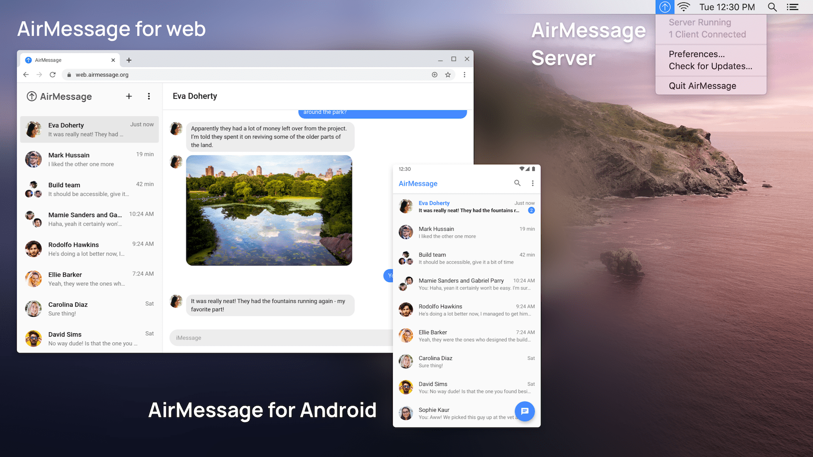

# AirMessage Server

AirMessage lets people use iMessage on the devices they like.
**AirMessage Server** functions as the bridge between AirMessage client apps and iMessage by running as a service on a Mac computer.

Other AirMessage repositories:
[Android](https://github.com/airmessage/airmessage-android) |
[Web](https://github.com/airmessage/airmessage-web) |
[Connect (community)](https://github.com/airmessage/airmessage-connect-java)

## Getting started

AirMessage Server requires Xcode 12+ to build.

To generate a universal OpenSSL binary to link, run `Configure.command` in the `OpenSSL` directory.

AirMessage Server uses a configuration file to associate with online services like Firebase and Sentry.
The app will not build without valid configuration files, so to get started quickly, you can copy the provided default files to use a pre-configured Firebase project, or you may provide your own Firebase configuration file:
- `AirMessage/AuthSite/secrets.default.js` > `AirMessage/AuthSite/secrets.js`
- `AirMessage/Secrets.default.xcconfig` > `AirMessage/Secrets.xcconfig`

## Building and running for AirMessage Connect

In order to help developers get started quickly, we host a separate open-source version of AirMessage Connect at `connect-open.airmessage.org`.
The default configuration is pre-configured to authenticate and connect to this server.
Since this version of AirMessage Connect is hosted in a separate environment from official servers, you will have to connect client apps to the same AirMessage Connect server.

We kindly ask that you do not use AirMessage's official Connect servers with any unofficial builds of AirMessage-compatible software.

---

Thank you for your interest in contributing to AirMessage!
You're helping to shape the future of an open, secure messaging market.
Should you have any questions, comments, or concerns, please shoot an email to [hello@airmessage.org](mailto:hello@airmessage.org).
